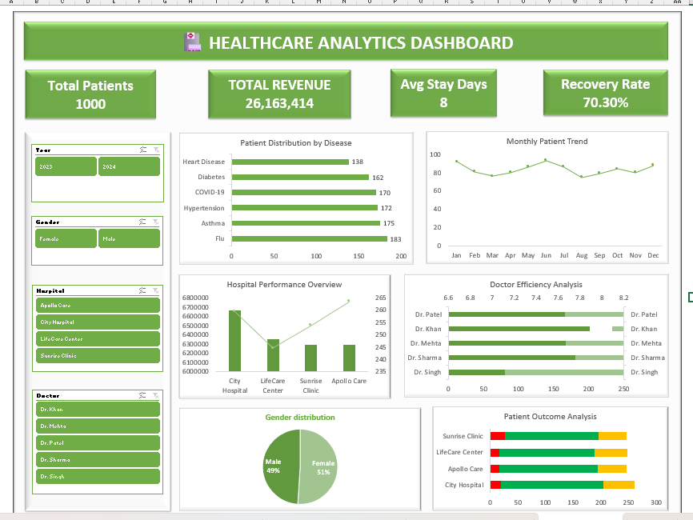

# Healthcare Excel Dashboard 📊

## 📌 Project Overview
This project is an Excel-based dashboard that analyzes healthcare data to provide insights into patient trends, revenue, and performance metrics.

## 📊 Key Features
- KPI Dashboard (Total Patients, Revenue, Avg Cost)
- Monthly & Yearly Trends
- Department-wise Analysis
- Interactive Charts

## 🛠 Tools Used
- Microsoft Excel
- Pivot Tables
- Charts & Graphs

## 📷 Dashboard Preview

## 📁 File Included
- healthcare excel project.xlsx

## 🚀 Purpose
This project demonstrates data analysis and dashboard creation skills for Business Analyst roles.
